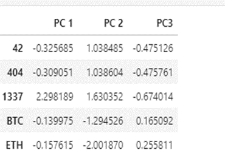
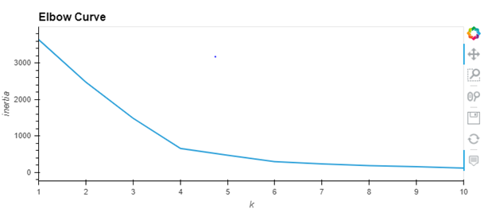
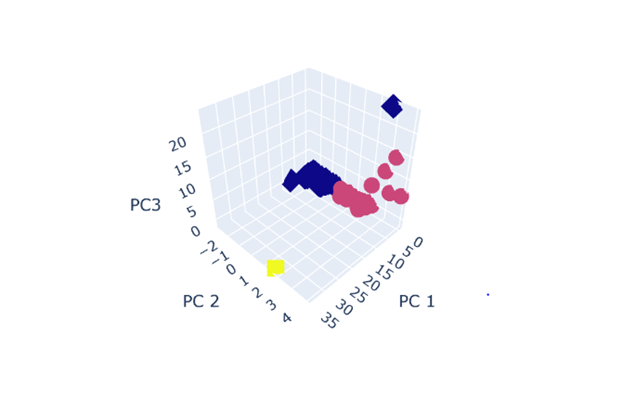

# AWS_Homework1

Brief Summary of Activity

This exercise involved the use of unsupervised learning skill to cluster cryptocurrencies and create plots to present the outcome.

First, the data was preprocessed by reading the csv file as well as dropping NA’s, columns creating dummy variables for text features and using StandardScaler to standardize all the data of the X DataFrame.

The second step was to reduce dimensions of the X DataFrame down to three principal components. 

Below is a screenshot of the outcome

 
In addition, K-Means algorithm was also applied to cluster the cryptocurrency using the PCA data. An elbow curve was plotted using hvplot to find best value for k after which we k, run the K-Means algorithm to predict the k clusters for the cryptocurrencies data.

 
The result of the clustered data was visualized using a 3D Scattered plot with the PCA data and the clusters as well as data tables

